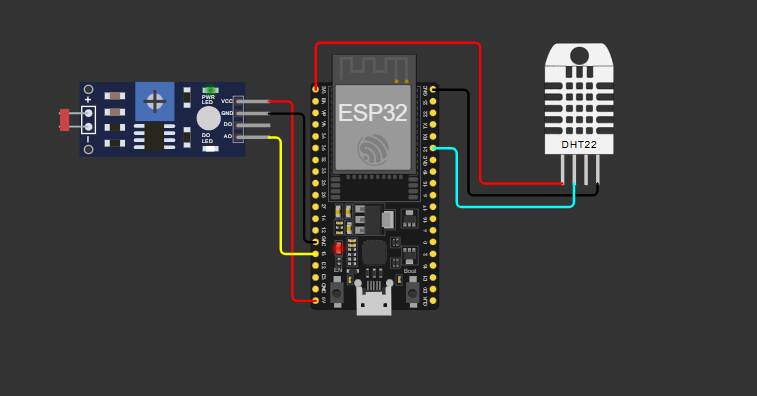

# GS-Edge-Computing: Sistema de Monitoramento Ambiental para Saúde e Bem-estar no Trabalho

##  Descrição do Problema

O futuro do trabalho já começou. Com os avanços tecnológicos como robótica, automação e Internet das Coisas (IoT), estamos vivenciando uma transformação nas profissões, criando novas oportunidades e desafios sem precedentes. Mudanças sociais, econômicas e ambientais estão remodelando a forma como vivemos, trabalhamos e aprendemos.

No contexto do ambiente de trabalho, condições ambientais inadequadas podem impactar significativamente a saúde, o bem-estar e a produtividade dos trabalhadores. Problemas como:

- **Temperatura inadequada**: Ambientes muito quentes ou frios causam desconforto térmico, reduzem a concentração e aumentam o consumo energético com climatização
- **Umidade do ar baixa**: Ar seco pode causar irritação ocular e respiratória, além de desconforto geral
- **Iluminação inadequada**: Baixa luminosidade aumenta a fadiga visual, reduz a produtividade e pode levar ao consumo desnecessário de iluminação artificial

A falta de monitoramento contínuo dessas variáveis ambientais impede a detecção proativa de problemas, resultando em ambientes de trabalho subótimos que afetam a saúde e o desempenho dos colaboradores.

##  Solução Proposta

Este projeto apresenta uma solução inovadora de **monitoramento ambiental inteligente** utilizando ESP32 e tecnologias IoT para promover saúde e bem-estar no trabalho. A solução implementa:

### Características Principais

1. **Monitoramento Contínuo**:
   - Temperatura ambiente (sensor DHT22)
   - Umidade relativa do ar (sensor DHT22)
   - Nível de luminosidade (sensor LDR)

2. **Sistema de Alertas Inteligentes**:
   - Alertas automáticos quando os parâmetros ambientais saem dos limites ideais
   - Sistema de controle de intervalo para evitar spam de notificações (30 segundos entre alertas)

3. **Integração IoT via HTTP**:
   - Envio de dados em tempo real para a plataforma ThingSpeak
   - Armazenamento histórico para análise de tendências
   - Visualização de dados através de dashboards

4. **Benefícios**:
   - **Prevenção**: Detecção precoce de condições inadequadas
   - **Eficiência Energética**: Otimização do uso de climatização e iluminação
   - **Bem-estar**: Promoção de ambientes mais confortáveis e saudáveis
   - **Produtividade**: Redução de desconfortos que afetam a concentração

### Limites de Monitoramento

- **Temperatura Máxima**: 30°C (calor excessivo)
- **Temperatura Mínima**: 15°C (ambiente frio demais)
- **Umidade Mínima**: 35% (ar muito seco)
- **Luminosidade Mínima**: 180 (baixa luminosidade)


### Especificações dos Sensores

**DHT22 (Temperature & Humidity Sensor)**
- Faixa de temperatura: -40°C a 80°C
- Precisão de temperatura: ±0.5°C
- Faixa de umidade: 0% a 100% RH
- Precisão de umidade: ±2% RH
- Alimentação: 3.3V a 5V
- Interface: Digital (1-wire)

**LDR (Light Dependent Resistor) Module**
- Resistor variável baseado na luz
- Saída analógica e digital
- Sensível à luz visível
- Potenciômetro para ajuste de sensibilidade

### Diagrama do Circuito



*Diagrama mostrando as conexões entre ESP32, sensor DHT22 e módulo LDR*

### Descrição do Circuito

O circuito é composto por:

1. **ESP32** no centro do circuito, responsável pelo processamento e comunicação WiFi
2. **DHT22** posicionado à direita, conectado ao pino GPIO 21 para leitura de temperatura e umidade
3. **Módulo LDR** à esquerda, com o sensor de luz conectado aos pinos analógicos GPIO 34 (AD) e GPIO 35 (DO)

##  Dependências

### Bibliotecas Necessárias

Este projeto utiliza as seguintes bibliotecas do Arduino/ESP32:

1. **WiFi.h** (nativa do ESP32)
   - Gerenciamento de conexão WiFi
   - Funções para conectar e verificar status da conexão

2. **HTTPClient.h** (nativa do ESP32)
   - Cliente HTTP para comunicação com APIs
   - Envio de requisições GET/POST

3. **DHT.h** (biblioteca externa)
   - Comunicação com sensor DHT22
   - Leitura de temperatura e umidade
   - Instalação: `Arduino Library Manager` → buscar "DHT sensor library" por Adafruit

##  Instruções de Uso

### Pré-requisitos

1. **Hardware montado** conforme o diagrama de circuito
2. **Conta no ThingSpeak** criada (gratuita em [thingspeak.com](https://thingspeak.com))
3. **Canal ThingSpeak configurado** com 3 campos:
   - Field 1: Temperatura
   - Field 2: Umidade
   - Field 3: Luminosidade
4. **API Key do ThingSpeak** anotada

### Configuração Inicial

1. **Clone ou baixe este repositório**

2. **Configure as credenciais WiFi no código**:
   ```cpp
   const char* ssid = "SUA_REDE_WIFI";
   const char* password = "SUA_SENHA_WIFI";
   ```

3. **Configure a API Key do ThingSpeak**:
   ```cpp
   String apiKey = "SUA_API_KEY_AQUI";
   ```

4. **Compile e faça upload** para o ESP32

### Simulação no Wokwi

Você pode simular este projeto no Wokwi sem necessidade de hardware físico:

🔗 **[Link para o Projeto no Wokwi](https://wokwi.com/projects/448267650463565825)**

Acesse o link acima para simular o projeto diretamente no navegador, sem necessidade de hardware físico.

### Execução

1. **Conecte o ESP32** ao computador via USB
2. **Abra o Monitor Serial** na velocidade 115200 baud
3. **Aguarde a conexão WiFi** - você verá mensagens como "Conectando ao WiFi...."
4. **Após conectar**, o sistema começará a:
   - Ler os sensores a cada 15 segundos
   - Enviar dados para o ThingSpeak
   - Verificar condições de alerta a cada 30 segundos
   - Exibir mensagens no Serial Monitor

### Interpretação dos Dados

**Serial Monitor** mostrará:
- Status da conexão WiFi
- Confirmação de envio de dados ("Dados enviados!")
- Alertas quando condições ambientais estiverem fora dos limites

**ThingSpeak Dashboard** permitirá:
- Visualizar gráficos em tempo real
- Analisar histórico de dados
- Configurar alertas e notificações

##  Endpoints HTTP Utilizados

Este projeto utiliza comunicação HTTP para enviar dados à plataforma ThingSpeak.

### ThingSpeak Update API

**Endpoint Base:**
```
http://api.thingspeak.com/update
```

**Método HTTP:** `GET`

**Parâmetros da URL:**
- `api_key` (obrigatório): Chave de API do seu canal ThingSpeak
- `field1`: Valor da temperatura (em graus Celsius)
- `field2`: Valor da umidade (em percentual)
- `field3`: Valor da luminosidade (valor analógico do LDR)


### Códigos de Resposta

- **200**: Dados atualizados com sucesso
- **-1**: Erro de conexão
- **Outros códigos negativos**: Erros HTTP diversos

### Como Obter a API Key do ThingSpeak

1. Acesse [thingspeak.com](https://thingspeak.com) e crie uma conta
2. Crie um novo canal (Channel)
3. Configure os 3 campos (Field 1, 2 e 3)
4. Acesse a aba **"API Keys"**
5. Copie a **"Write API Key"**
6. Cole no código na variável `apiKey`

## 📊 Funcionamento do Sistema

### Fluxo de Execução

1. **Inicialização (`setup()`)**
   - Inicializa comunicação serial (115200 baud)
   - Inicializa sensor DHT22
   - Conecta à rede WiFi
   - Aguarda conexão estabelecida

2. **Loop Principal (`loop()`)**
   - Verifica se WiFi está conectado
   - Lê dados dos sensores (temperatura, umidade, luminosidade)
   - Valida leitura do DHT22
   - Constrói URL para ThingSpeak
   - Envia requisição HTTP GET
   - Processa resposta
   - Verifica condições de alerta (a cada 30 segundos)
   - Aguarda 15 segundos (intervalo mínimo do ThingSpeak)

3. **Sistema de Alertas**
   - Verifica intervalos: temperatura muito alta/baixa, umidade baixa, luminosidade baixa
   - Emite alertas no Serial Monitor
   - Controla frequência (máximo um ciclo de alertas a cada 30 segundos)

## 🎯 Aplicações Práticas

Este sistema pode ser utilizado em:

- **Escritórios**: Monitoramento de condições ambientais para bem-estar dos funcionários
- **Salas de aula**: Garantir ambiente adequado para aprendizagem
- **Bibliotecas**: Controle de iluminação e clima
- **Laboratórios**: Monitoramento de condições ambientais críticas
- **Hospitais/Clínicas**: Monitoramento de áreas de recuperação
- **Fábricas**: Áreas administrativas e de descanso

## 👨‍💻 Autor

Desenvolvido como parte do projeto **GS-Edge-Computing** - Demonstrando como a tecnologia IoT pode transformar o trabalho, a educação e o bem-estar humano em um futuro cada vez mais digital e automatizado.

Integrantes: 

Diego Zandonadi RM 561488
Davi Alves Dos Santos RM 566279
---

## Link do projeto 
- https://wokwi.com/projects/448267650463565825

**O futuro do trabalho já começou.** 🚀
